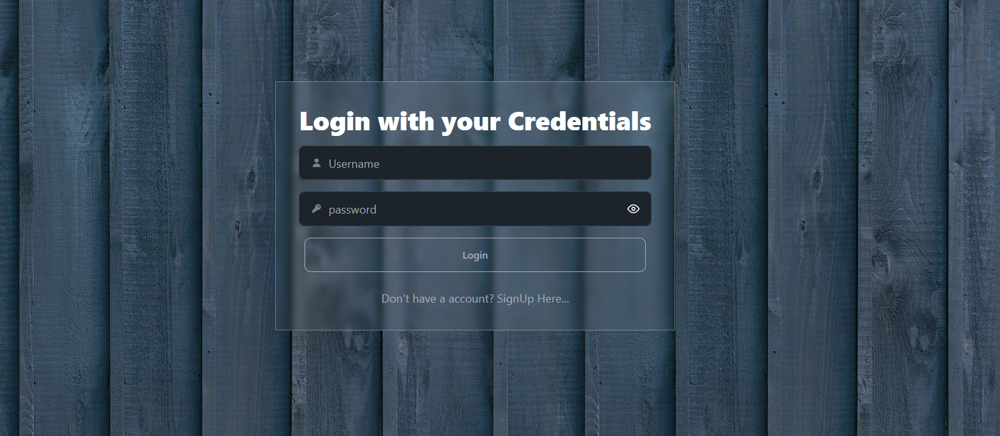
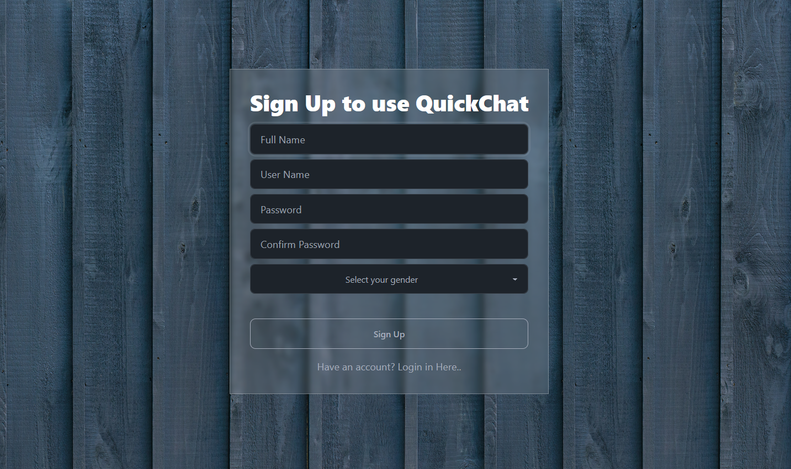
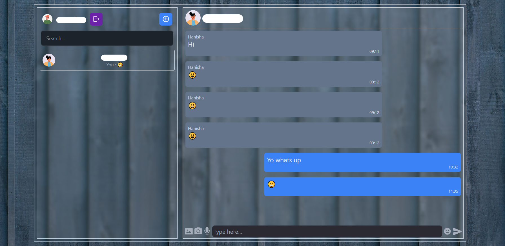
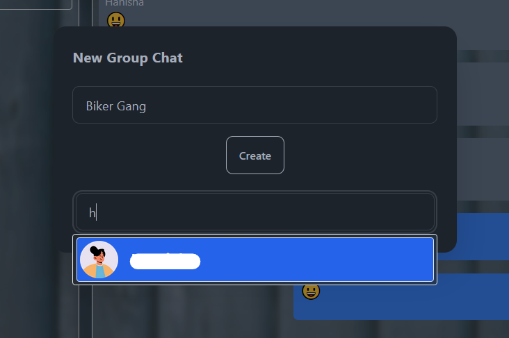

# Realtime Chat App with MERN stack

### Introduction

This repo consists of complete code to my project RealTimePager - (Realtime Chat Application) built with the MERN stack. I developed this project to practice using socket.io while learning.

### Feature

- Passport.js Authentication.
- One-on-one **Private Chat** where users can chat with others privately.
- Create a room and start a **Room Chat** for users who want to broadcast messages to a specific group of users.
- Basic features for Real time chat user experience.

### Technologies

- database - MongoDB
- backend - Express.js & Node.js
- frontend - React.js (with styled-components)
- Real-time messages - Socket.io
- authentication - passportjs

### Deploy

- database: MongoDB Atlas
- deployed: render

### Live Demo

https://realtimepager.onrender.com/

### Screenshots

**Login**


**Register**


**Chat**


**Create Group**


### How to use

1. Clone the repo
   ```
   git clone https://github.com/Manohar-Penta/real-time-chat-app.git
   ```
2. Enter the directory
   ```
   cd real-time-chat-app
   ```
3. Install dependencies
   ```
   npm install
   ```
4. Create your .env file with following fields :

   - PORT : desired port to your application to listen and respond on.
   - mongo_uri : url to access your mongodb database.
   - SECRET : secret to sign your cookies.

5. Build the frontend
   ```
   npm run build
   ```
6. Run the application
   ```
   npm run start
   ```
